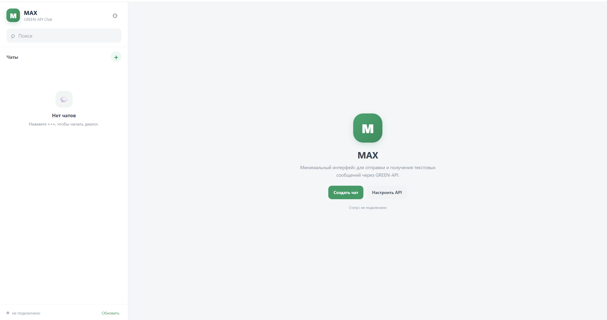

# GREEN-API:MAX chat
Тестовое задание: https://drive.google.com/file/d/1Ut39kkIs0QK-swnCsIPJc6pNqVIVGOD2/view


Тестовое задание: минимальный web-интерфейс чата для отправки и получения **текстовых сообщений в MAX** через GREEN-API.

## Что реализовано

- React + TypeScript + Vite.
- Интерфейс в стиле современного веб-чата: список диалогов, поиск, шапка чата, история, composer.
- Подключение к GREEN-API через `apiUrl`, `idInstance`, `apiTokenInstance`.
- Проверка состояния инстанса через `getStateInstance`.
- Получение информации об аккаунте через `getAccountSettings`.
- Создание нового чата по номеру телефона через `checkAccount`.
- Отправка текста через `sendMessage`.
- Получение входящих уведомлений через `receiveNotification` и подтверждение через `deleteNotification`.
- Входящие уведомления других типов удаляются из очереди, а в UI добавляются только текстовые `incomingMessageReceived`.
- До 4000 символов в composer, Enter — отправка, Shift+Enter — перенос строки.
- Состояния отправки: sending / sent / error.
- Данные подключения сохраняются в `localStorage` браузера.
- Адаптивная верстка для узких экранов.

## Запуск

Требуется Node.js 20+.

```bash
npm install
npm run dev
```

После запуска откройте адрес, который покажет Vite (обычно `http://localhost:5173`).

Для production-сборки:

```bash
npm run build
npm run preview
```

## Настройка GREEN-API

При первом запуске откроется окно подключения. Введите:

- **API URL** — обычно `https://api.green-api.com`;
- **ID Instance** — идентификатор вашего инстанса;
- **API Token Instance** — токен инстанса.

Данные можно также задать через `.env` на основе `.env.example`.

> Важно: это демонстрационный frontend-only проект, поэтому токен используется в браузере. Для production-системы токен не следует отдавать клиенту: запросы к GREEN-API лучше выполнять через backend/proxy.

## Приём сообщений

Для режима HTTP API у инстанса GREEN-API должен быть настроен приём уведомлений через HTTP API: `webhookUrl` должен быть пустым, а получение входящих сообщений включено в настройках инстанса. Клиент последовательно вызывает `ReceiveNotification`, обрабатывает уведомление и вызывает `DeleteNotification`.

## Документация

- MAX API GREEN-API: https://green-api.com/max
- SendMessage: https://green-api.com/v3/docs/api/sending/SendMessage/
- ReceiveNotification: https://green-api.com/v3/docs/api/receiving/technology-http-api/ReceiveNotification/
- DeleteNotification: https://green-api.com/v3/docs/api/receiving/technology-http-api/DeleteNotification/
- CheckAccount: https://green-api.com/v3/docs/api/service/CheckAccount/
- HTTP API receiving: https://green-api.com/v3/docs/api/receiving/technology-http-api/

## Архитектура

```text
src/
  api.ts       — типизированный HTTP-клиент GREEN-API
  storage.ts   — хранение настроек подключения
  types.ts     — типы чатов и сообщений
  App.tsx      — UI и сценарии чата
  styles.css   — стили интерфейса
  main.tsx     — точка входа
```


